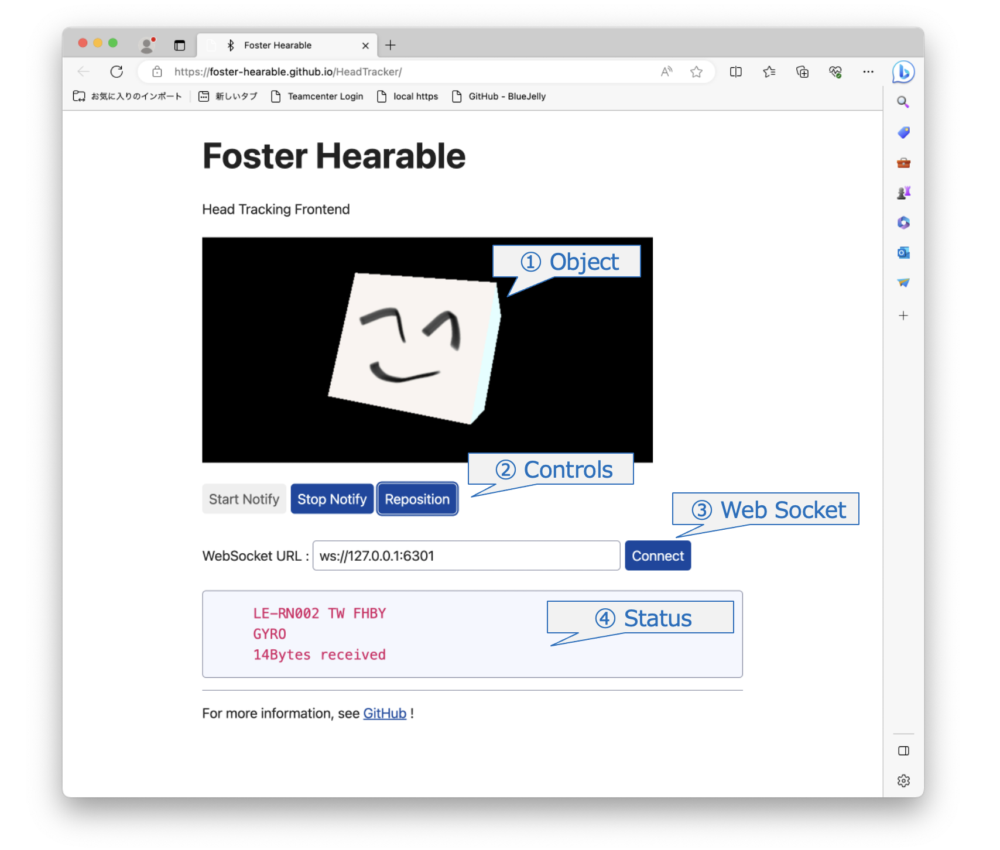

# Hearable HeadTracker
---
### Overview
Hearable HeadTrackerはヒアラブルデバイス（フォスター電機 RN002）に実装されているヘッドトラッキング機能のフロントエンドアプリケーションです。

WebBluetoothを用いてヒアラブルデバイスRN002からデータ取得を行い、ブラウザに表示されているオブジェクトの回転、およびWebSocket経由で任意の宛先に送出します。\
オブジェクトの回転およびWebSocketのデータは、ヒアラブルデバイスのジャイロセンサー／加速度センサーの出力をMadgwickフィルタにより四元数（Quaternion）に変換しており、Thress.jsやUnityなどの3Dオブジェクト制御に使用することが可能です。

### 対応ブラウザ
WebBluetoothに対応したブラウザ　参考：[ブラウザー互換性一覧表 Mozilla.org](https://developer.mozilla.org/ja/docs/Web/API/Web_Bluetooth_API#ブラウザーの互換性)

#### 動作することを確認しているブラウザ
- Chrome（Windows,Mac）
- Edge（Windows,Mac）
  
#### 動作しないことを確認しているブラウザ
- Safari（Mac,iOS）

### 操作インターフェース

#### ① Object\
ヒアラブルデバイスより送られてくるデータに合わせて回転します。\
接続直後や大きく回転した直後にはフィルタによる補正が動作し、ヒアラブルデバイスが動いていない場合であっても適切な位置まで徐々に回転することがあります。

#### ② Controls
- Start Notify：クリックするとヒアラブルデバイスとの接続ウィンドウが表示されます（接続後、データが送られてくるまで20秒程度かかる場合があります）
- Stop Notify：ヒアラブルデバイスとの接続を解除する場合にクリックします。再度接続したい場合にはブラウザをリロードしてください。
- Reposition：Objectの向きを正面に戻します。ヒアラブルデバイスの実際の向きとObjectの向きを合わせる場合にクリックしてください。

#### ③ WebSocket
- WebSocket URL：WebSocketで接続するURLを指定してください。
- Connect：WebSocket URLとの接続/切断を行います。本ページがロードされた直後に自動的に接続を試みます。
  
#### ④ Status
- 接続しているデバイス名や受信したデータの種別やデータ数を表示します

### WebSocketでの拡張

